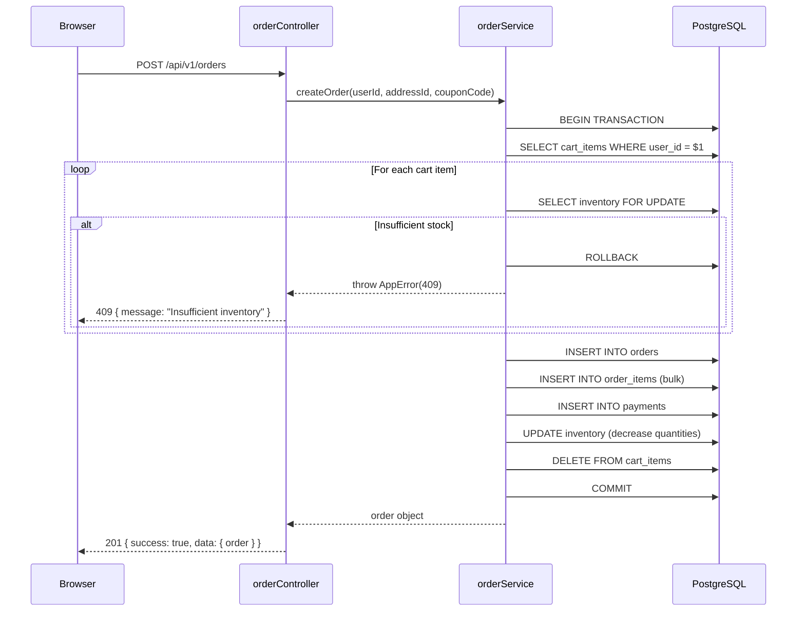
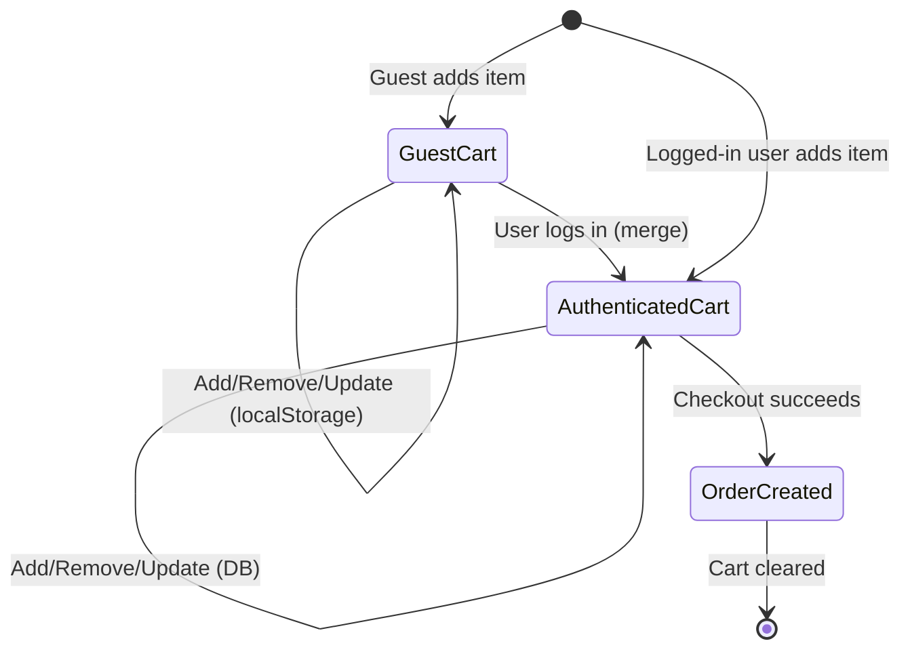

# Design Document: Premium Clothing E-Commerce Platform

## Overview

This document describes the technical design for a full-stack clothing e-commerce platform built with Node.js/Express.js (MVC backend), PostgreSQL, and a vanilla HTML5/Bootstrap 5 frontend. The design implements all 24 requirements from the requirements document and aligns with the Google Stitch visual reference.

The platform provides:
- Customer-facing storefront: browsing, search/filter, cart, wishlist, checkout, order tracking, reviews
- Admin dashboard: product/inventory management, order fulfillment, analytics, coupons, customer management
- Secure authentication via JWT stored in httpOnly cookies
- RESTful API with /api/v1/ versioning

### Key Design Decisions

1. **MVC Architecture** — Controllers handle HTTP logic, Services contain business rules, Models encapsulate database queries. This separates concerns cleanly and keeps controllers thin.
2. **JWT in httpOnly Cookies** — Prevents XSS token theft compared to localStorage while still enabling stateless authentication.
3. **PostgreSQL + pg-pool** — Relational integrity via foreign keys and transactions. Connection pooling prevents per-request connection overhead.
4. **RESTful API** — Frontend and backend are fully decoupled; the frontend is a pure client that communicates via fetch() calls against the versioned API.
5. **Soft Deletes for Products** — Products are flagged `deleted = true` rather than physically removed, preserving order history integrity.
6. **Inventory Transactions** — All inventory mutations (checkout, cancellation, rollback) use PostgreSQL transactions to prevent race conditions.

---

## Architecture

### High-Level Architecture

```
┌─────────────────────────────────────────────────────────────────┐
│                        CLIENT LAYER                             │
│  Browser (HTML5 + Bootstrap 5 + Vanilla JS)                     │
│  ┌──────────┐ ┌──────────┐ ┌──────────┐ ┌──────────────────┐   │
│  │  index   │ │  shop    │ │ product  │ │  cart/checkout   │   │
│  │  .html   │ │  .html   │ │  .html   │ │  .html           │   │
│  └──────────┘ └──────────┘ └──────────┘ └──────────────────┘   │
│  ┌──────────┐ ┌──────────┐ ┌──────────┐ ┌──────────────────┐   │
│  │ profile  │ │wishlist  │ │ orders   │ │  admin panel     │   │
│  │  .html   │ │  .html   │ │  .html   │ │  (admin.html)    │   │
│  └──────────┘ └──────────┘ └──────────┘ └──────────────────┘   │
│                        fetch() / XHR                            │
└─────────────────────────────┬───────────────────────────────────┘
                              │ HTTPS  /api/v1/
┌─────────────────────────────▼───────────────────────────────────┐
│                      BACKEND LAYER (Express.js)                 │
│                                                                 │
│  ┌──────────────────────────────────────────────────────────┐   │
│  │  Middleware Pipeline                                     │   │
│  │  helmet → cors → rate-limit → cookie-parser → json      │   │
│  │  → auth middleware → express-validator → routes         │   │
│  └──────────────────────────────────────────────────────────┘   │
│                                                                 │
│  ┌─────────────┐  ┌─────────────┐  ┌─────────────────────────┐ │
│  │   Routes    │→ │ Controllers │→ │       Services          │ │
│  │ /api/v1/    │  │  (thin)     │  │  (business logic)       │ │
│  └─────────────┘  └─────────────┘  └───────────┬─────────────┘ │
│                                                │               │
│  ┌─────────────────────────────────────────────▼─────────────┐ │
│  │                    Models (pg queries)                    │ │
│  └─────────────────────────────────────────────┬─────────────┘ │
│                                                │               │
└────────────────────────────────────────────────│───────────────┘
                                                 │ pg-pool
┌────────────────────────────────────────────────▼───────────────┐
│                   DATA LAYER (PostgreSQL)                       │
│  Tables: Users, Roles, Categories, Products, Product_Images,   │
│  Sizes, Colors, Inventory, Cart, Cart_Items, Wishlist,         │
│  Orders, Order_Items, Payments, Reviews, Coupons, Addresses    │
└─────────────────────────────────────────────────────────────────┘
```

### Request Lifecycle

```
Browser → HTTPS Request
  → Helmet (security headers)
  → CORS check
  → Rate limiter
  → cookie-parser (reads JWT from httpOnly cookie)
  → authenticateJWT middleware (verifies token, attaches req.user)
  → express-validator (schema validation)
  → Route handler
  → Controller (extracts params, calls service)
  → Service (business logic, calls model)
  → Model (parameterized SQL via pg-pool)
  → PostgreSQL
  ← JSON response with consistent shape
```

---

## Components and Interfaces

### Backend Folder Structure

```
backend/
├── app.js                    # Express app setup, middleware registration
├── server.js                 # HTTP server startup, graceful shutdown
├── config/
│   ├── db.js                 # pg-pool configuration and export
│   ├── env.js                # Environment variable validation/export
│   └── multer.js             # Multer storage configuration
├── controllers/
│   ├── authController.js
│   ├── productController.js
│   ├── categoryController.js
│   ├── cartController.js
│   ├── wishlistController.js
│   ├── orderController.js
│   ├── reviewController.js
│   ├── couponController.js
│   ├── addressController.js
│   ├── userController.js
│   ├── adminController.js
│   └── contactController.js
├── middleware/
│   ├── authenticateJWT.js    # JWT verification from httpOnly cookie
│   ├── authorizeRole.js      # Role-based access (admin/customer)
│   ├── rateLimiter.js        # express-rate-limit instances
│   ├── uploadMiddleware.js   # Multer file upload handlers
│   ├── errorHandler.js       # Global error handler
│   └── requestLogger.js      # Morgan + Winston logging
├── models/
│   ├── userModel.js
│   ├── productModel.js
│   ├── categoryModel.js
│   ├── cartModel.js
│   ├── wishlistModel.js
│   ├── orderModel.js
│   ├── reviewModel.js
│   ├── couponModel.js
│   ├── addressModel.js
│   ├── inventoryModel.js
│   └── contactModel.js
├── routes/
│   ├── index.js              # Mounts all route modules under /api/v1/
│   ├── authRoutes.js
│   ├── productRoutes.js
│   ├── categoryRoutes.js
│   ├── cartRoutes.js
│   ├── wishlistRoutes.js
│   ├── orderRoutes.js
│   ├── reviewRoutes.js
│   ├── couponRoutes.js
│   ├── addressRoutes.js
│   ├── userRoutes.js
│   ├── adminRoutes.js
│   └── contactRoutes.js
├── services/
│   ├── authService.js        # JWT generation, bcrypt operations
│   ├── productService.js     # Product CRUD, image handling
│   ├── cartService.js        # Cart logic, guest-to-auth merge
│   ├── orderService.js       # Order creation, inventory transactions
│   ├── searchService.js      # Query building, filter logic
│   ├── couponService.js      # Coupon validation, discount calc
│   ├── analyticsService.js   # Revenue, metrics queries
│   ├── emailService.js       # Nodemailer wrappers
│   └── reviewService.js      # Review validation, moderation
├── utils/
│   ├── ApiResponse.js        # Consistent JSON response shape
│   ├── AppError.js           # Custom error class
│   ├── validators.js         # express-validator schemas
│   ├── sanitize.js           # Output sanitization helpers
│   └── pagination.js         # Pagination helper (offset/limit)
├── uploads/
│   ├── products/             # Product images
│   └── profiles/             # User profile pictures
└── database/
    ├── database.sql          # Schema DDL
    └── seed.sql              # Initial data (categories, admin user)
```

### Frontend Folder Structure

```
frontend/
├── index.html                # Home page
├── shop.html                 # Product listing
├── product.html              # Product detail
├── cart.html                 # Cart management
├── checkout.html             # Checkout flow
├── login.html                # Authentication
├── register.html             # Registration
├── profile.html              # User profile management
├── wishlist.html             # Saved products
├── orders.html               # Order history
├── contact.html              # Contact/support form
├── about.html                # Company information
└── admin/
    ├── index.html            # Admin dashboard home (analytics)
    ├── products.html         # Product management table
    ├── orders.html           # Order management
    ├── customers.html        # Customer management
    ├── coupons.html          # Coupon management
    ├── reviews.html          # Review moderation
    └── settings.html         # Site settings

assets/
├── css/
│   ├── variables.css         # CSS custom properties (colors, fonts, spacing)
│   ├── style.css             # Base styles, typography, resets
│   ├── components.css        # Reusable component styles (cards, buttons, modals)
│   ├── animations.css        # Transitions, hover effects, keyframes
│   ├── responsive.css        # Breakpoint overrides (768px, 1024px, 1366px, 1920px)
│   ├── shop.css              # Shop page layout, filter sidebar
│   ├── product.css           # Product detail layout, image gallery
│   ├── auth.css              # Login/register forms
│   └── admin.css             # Admin dashboard grid and tables
└── js/
    ├── main.js               # Global init, utilities, constants
    ├── navbar.js             # Mobile nav toggle, active states, cart count
    ├── slider.js             # Home page hero carousel
    ├── cart.js               # Cart API calls, quantity controls, totals
    ├── wishlist.js           # Wishlist toggle, sync with backend
    ├── checkout.js           # Checkout form, coupon, order submission
    ├── auth.js               # Login/register form submission, JWT storage
    ├── validation.js         # Client-side form validation rules
    ├── search.js             # Debounced search input handler
    ├── filters.js            # Filter sidebar state, apply/reset filters
    ├── profile.js            # Profile update, password change, avatar upload
    └── admin.js              # Admin dashboard charts, tables, CRUD modals
```

### API Route Map

All routes are prefixed with `/api/v1`.

| Method | Endpoint | Auth | Description |
|--------|----------|------|-------------|
| POST | /auth/register | None | Register new customer |
| POST | /auth/login | None | Login, set JWT cookie |
| POST | /auth/logout | Customer | Clear JWT cookie |
| GET | /auth/me | Customer | Get current user info |
| GET | /products | None | List products (paginated, filterable) |
| GET | /products/:id | None | Get product detail |
| POST | /products | Admin | Create product |
| PUT | /products/:id | Admin | Update product |
| DELETE | /products/:id | Admin | Soft-delete product |
| POST | /products/:id/images | Admin | Upload product images |
| GET | /categories | None | List all categories |
| POST | /categories | Admin | Create category |
| GET | /cart | Customer | Get user's cart |
| POST | /cart/items | Customer | Add item to cart |
| PUT | /cart/items/:itemId | Customer | Update item quantity |
| DELETE | /cart/items/:itemId | Customer | Remove cart item |
| POST | /cart/merge | Customer | Merge guest cart on login |
| GET | /wishlist | Customer | Get user's wishlist |
| POST | /wishlist | Customer | Add product to wishlist |
| DELETE | /wishlist/:productId | Customer | Remove from wishlist |
| GET | /orders | Customer | List user's orders |
| GET | /orders/:id | Customer | Get order detail |
| POST | /orders | Customer | Create order (checkout) |
| GET | /admin/orders | Admin | List all orders |
| PUT | /admin/orders/:id/status | Admin | Update order status |
| DELETE | /orders/:id | Customer | Cancel order |
| GET | /reviews/product/:productId | None | Get product reviews |
| POST | /reviews | Customer | Submit review |
| PUT | /admin/reviews/:id/approve | Admin | Approve review |
| DELETE | /admin/reviews/:id | Admin | Delete review |
| GET | /coupons/validate | Customer | Validate a coupon code |
| POST | /admin/coupons | Admin | Create coupon |
| PUT | /admin/coupons/:id | Admin | Update coupon |
| GET | /addresses | Customer | List saved addresses |
| POST | /addresses | Customer | Add address |
| PUT | /addresses/:id | Customer | Update address |
| DELETE | /addresses/:id | Customer | Delete address |
| PUT | /addresses/:id/default | Customer | Set default address |
| GET | /users/profile | Customer | Get profile |
| PUT | /users/profile | Customer | Update profile |
| PUT | /users/password | Customer | Change password |
| POST | /users/avatar | Customer | Upload avatar |
| GET | /admin/customers | Admin | List customers |
| GET | /admin/customers/:id | Admin | Get customer detail |
| PUT | /admin/customers/:id/deactivate | Admin | Deactivate customer |
| GET | /admin/analytics | Admin | Get analytics data |
| POST | /contact | None | Submit contact form |
| GET | /admin/contact | Admin | List contact submissions |
| GET | /health | None | Health check |
| GET | /api/status | None | API status |

### API Response Contract

All responses follow this consistent JSON shape:

```javascript
// Success
{
  "success": true,
  "message": "Products retrieved successfully",
  "data": { ... },        // Single object or array
  "pagination": {         // Present on paginated list endpoints
    "page": 1,
    "limit": 20,
    "total": 150,
    "pages": 8
  }
}

// Error
{
  "success": false,
  "message": "Validation failed",
  "errors": [             // Present on validation errors (400)
    { "field": "email", "message": "Invalid email format" }
  ]
}
```

### Key Module Interfaces

**ApiResponse utility** (utils/ApiResponse.js):
```javascript
class ApiResponse {
  static success(res, data, message = 'Success', statusCode = 200) { ... }
  static paginated(res, data, pagination, message = 'Success') { ... }
  static error(res, message, statusCode = 500, errors = []) { ... }
}
```

**AppError** (utils/AppError.js):
```javascript
class AppError extends Error {
  constructor(message, statusCode, errors = []) {
    this.statusCode = statusCode;
    this.errors = errors;
    this.isOperational = true;
  }
}
```

**Auth Middleware** (middleware/authenticateJWT.js):
```javascript
// Reads JWT from req.cookies.token
// Verifies with process.env.JWT_SECRET
// Attaches decoded payload to req.user
// Throws 401 if missing or invalid
```

**authorizeRole** (middleware/authorizeRole.js):
```javascript
// authorizeRole('admin')  — requires req.user.role === 'admin'
// authorizeRole('customer') — requires req.user.role === 'customer'
// Throws 403 on mismatch
```

---
## Data Models

### Entity Relationship Overview

```
Users ──< Addresses
Users ──< Cart ──< Cart_Items >── Products
Users ──< Wishlist >── Products
Users ──< Orders ──< Order_Items >── Products
Users ──< Reviews >── Products
Orders ──< Payments
Orders >── Coupons
Products >── Categories
Products ──< Product_Images
Products ──< Inventory >── Sizes
Products ──< Inventory >── Colors
Users >── Roles
```

### Table Schemas

#### Users
```sql
CREATE TABLE users (
  id            SERIAL PRIMARY KEY,
  role_id       INTEGER NOT NULL REFERENCES roles(id) DEFAULT 2,  -- 1=admin, 2=customer
  first_name    VARCHAR(100) NOT NULL,
  last_name     VARCHAR(100) NOT NULL,
  email         VARCHAR(255) NOT NULL UNIQUE,
  password_hash VARCHAR(255) NOT NULL,
  phone         VARCHAR(20),
  avatar_url    VARCHAR(500),
  is_active     BOOLEAN NOT NULL DEFAULT TRUE,
  created_at    TIMESTAMP WITH TIME ZONE DEFAULT NOW(),
  updated_at    TIMESTAMP WITH TIME ZONE DEFAULT NOW()
);
CREATE INDEX idx_users_email ON users(email);
```

#### Roles
```sql
CREATE TABLE roles (
  id   SERIAL PRIMARY KEY,
  name VARCHAR(50) NOT NULL UNIQUE  -- 'admin', 'customer'
);
```

#### Categories
```sql
CREATE TABLE categories (
  id          SERIAL PRIMARY KEY,
  name        VARCHAR(100) NOT NULL UNIQUE,
  slug        VARCHAR(120) NOT NULL UNIQUE,
  description TEXT,
  image_url   VARCHAR(500),
  is_active   BOOLEAN NOT NULL DEFAULT TRUE,
  created_at  TIMESTAMP WITH TIME ZONE DEFAULT NOW()
);
```

#### Products
```sql
CREATE TABLE products (
  id            SERIAL PRIMARY KEY,
  category_id   INTEGER NOT NULL REFERENCES categories(id),
  name          VARCHAR(255) NOT NULL,
  slug          VARCHAR(300) NOT NULL UNIQUE,
  description   TEXT,
  price         DECIMAL(10,2) NOT NULL CHECK (price > 0),
  sale_price    DECIMAL(10,2) CHECK (sale_price > 0),
  sku           VARCHAR(100) UNIQUE,
  is_active     BOOLEAN NOT NULL DEFAULT TRUE,
  is_deleted    BOOLEAN NOT NULL DEFAULT FALSE,  -- soft delete
  created_at    TIMESTAMP WITH TIME ZONE DEFAULT NOW(),
  updated_at    TIMESTAMP WITH TIME ZONE DEFAULT NOW()
);
CREATE INDEX idx_products_category ON products(category_id);
CREATE INDEX idx_products_name ON products USING gin(to_tsvector('english', name));
CREATE INDEX idx_products_active ON products(is_active, is_deleted);
```

#### Product_Images
```sql
CREATE TABLE product_images (
  id          SERIAL PRIMARY KEY,
  product_id  INTEGER NOT NULL REFERENCES products(id) ON DELETE CASCADE,
  url         VARCHAR(500) NOT NULL,
  alt_text    VARCHAR(255),
  is_primary  BOOLEAN NOT NULL DEFAULT FALSE,
  sort_order  INTEGER NOT NULL DEFAULT 0,
  created_at  TIMESTAMP WITH TIME ZONE DEFAULT NOW()
);
CREATE INDEX idx_product_images_product ON product_images(product_id);
```

#### Sizes
```sql
CREATE TABLE sizes (
  id    SERIAL PRIMARY KEY,
  name  VARCHAR(20) NOT NULL UNIQUE  -- 'XS', 'S', 'M', 'L', 'XL', 'XXL', '28', '30', etc.
);
```

#### Colors
```sql
CREATE TABLE colors (
  id        SERIAL PRIMARY KEY,
  name      VARCHAR(50) NOT NULL UNIQUE,
  hex_code  CHAR(7)                         -- e.g. '#FF5733'
);
```

#### Inventory
```sql
CREATE TABLE inventory (
  id          SERIAL PRIMARY KEY,
  product_id  INTEGER NOT NULL REFERENCES products(id) ON DELETE CASCADE,
  size_id     INTEGER NOT NULL REFERENCES sizes(id),
  color_id    INTEGER NOT NULL REFERENCES colors(id),
  quantity    INTEGER NOT NULL DEFAULT 0 CHECK (quantity >= 0),
  updated_at  TIMESTAMP WITH TIME ZONE DEFAULT NOW(),
  UNIQUE (product_id, size_id, color_id)
);
CREATE INDEX idx_inventory_product ON inventory(product_id);
```

#### Cart
```sql
CREATE TABLE cart (
  id          SERIAL PRIMARY KEY,
  user_id     INTEGER NOT NULL UNIQUE REFERENCES users(id) ON DELETE CASCADE,
  created_at  TIMESTAMP WITH TIME ZONE DEFAULT NOW(),
  updated_at  TIMESTAMP WITH TIME ZONE DEFAULT NOW()
);
```

#### Cart_Items
```sql
CREATE TABLE cart_items (
  id          SERIAL PRIMARY KEY,
  cart_id     INTEGER NOT NULL REFERENCES cart(id) ON DELETE CASCADE,
  product_id  INTEGER NOT NULL REFERENCES products(id),
  size_id     INTEGER NOT NULL REFERENCES sizes(id),
  color_id    INTEGER NOT NULL REFERENCES colors(id),
  quantity    INTEGER NOT NULL DEFAULT 1 CHECK (quantity > 0),
  added_at    TIMESTAMP WITH TIME ZONE DEFAULT NOW(),
  UNIQUE (cart_id, product_id, size_id, color_id)
);
CREATE INDEX idx_cart_items_cart ON cart_items(cart_id);
```

#### Wishlist
```sql
CREATE TABLE wishlist (
  id          SERIAL PRIMARY KEY,
  user_id     INTEGER NOT NULL REFERENCES users(id) ON DELETE CASCADE,
  product_id  INTEGER NOT NULL REFERENCES products(id) ON DELETE CASCADE,
  added_at    TIMESTAMP WITH TIME ZONE DEFAULT NOW(),
  UNIQUE (user_id, product_id)
);
CREATE INDEX idx_wishlist_user ON wishlist(user_id);
```

#### Orders
```sql
CREATE TABLE orders (
  id              SERIAL PRIMARY KEY,
  user_id         INTEGER NOT NULL REFERENCES users(id),
  order_number    VARCHAR(20) NOT NULL UNIQUE,  -- e.g. 'ORD-20240101-00001'
  status          VARCHAR(30) NOT NULL DEFAULT 'pending'
                    CHECK (status IN ('pending','processing','shipped','delivered','cancelled')),
  subtotal        DECIMAL(10,2) NOT NULL CHECK (subtotal >= 0),
  discount_amount DECIMAL(10,2) NOT NULL DEFAULT 0 CHECK (discount_amount >= 0),
  shipping_cost   DECIMAL(10,2) NOT NULL DEFAULT 0 CHECK (shipping_cost >= 0),
  total           DECIMAL(10,2) NOT NULL CHECK (total >= 0),
  coupon_id       INTEGER REFERENCES coupons(id),
  address_id      INTEGER NOT NULL REFERENCES addresses(id),
  tracking_number VARCHAR(100),
  estimated_delivery DATE,
  notes           TEXT,
  created_at      TIMESTAMP WITH TIME ZONE DEFAULT NOW(),
  updated_at      TIMESTAMP WITH TIME ZONE DEFAULT NOW()
);
CREATE INDEX idx_orders_user ON orders(user_id);
CREATE INDEX idx_orders_status ON orders(status);
CREATE INDEX idx_orders_created ON orders(created_at);
```

#### Order_Items
```sql
CREATE TABLE order_items (
  id            SERIAL PRIMARY KEY,
  order_id      INTEGER NOT NULL REFERENCES orders(id) ON DELETE CASCADE,
  product_id    INTEGER NOT NULL REFERENCES products(id),
  size_id       INTEGER NOT NULL REFERENCES sizes(id),
  color_id      INTEGER NOT NULL REFERENCES colors(id),
  product_name  VARCHAR(255) NOT NULL,   -- snapshot at time of order
  unit_price    DECIMAL(10,2) NOT NULL CHECK (unit_price > 0),
  quantity      INTEGER NOT NULL CHECK (quantity > 0),
  subtotal      DECIMAL(10,2) NOT NULL CHECK (subtotal > 0)
);
CREATE INDEX idx_order_items_order ON order_items(order_id);
```

#### Payments
```sql
CREATE TABLE payments (
  id                  SERIAL PRIMARY KEY,
  order_id            INTEGER NOT NULL UNIQUE REFERENCES orders(id),
  amount              DECIMAL(10,2) NOT NULL CHECK (amount > 0),
  method              VARCHAR(50) NOT NULL,  -- 'card', 'paypal', 'cod'
  status              VARCHAR(30) NOT NULL DEFAULT 'pending'
                        CHECK (status IN ('pending','completed','failed','refunded')),
  transaction_id      VARCHAR(255),
  payment_gateway     VARCHAR(50),
  created_at          TIMESTAMP WITH TIME ZONE DEFAULT NOW(),
  updated_at          TIMESTAMP WITH TIME ZONE DEFAULT NOW()
);
```

#### Reviews
```sql
CREATE TABLE reviews (
  id          SERIAL PRIMARY KEY,
  user_id     INTEGER NOT NULL REFERENCES users(id),
  product_id  INTEGER NOT NULL REFERENCES products(id),
  rating      SMALLINT NOT NULL CHECK (rating BETWEEN 1 AND 5),
  comment     TEXT NOT NULL CHECK (char_length(comment) BETWEEN 10 AND 500),
  status      VARCHAR(20) NOT NULL DEFAULT 'pending'
                CHECK (status IN ('pending','approved','rejected','flagged')),
  created_at  TIMESTAMP WITH TIME ZONE DEFAULT NOW(),
  UNIQUE (user_id, product_id)
);
CREATE INDEX idx_reviews_product ON reviews(product_id, status);
```

#### Coupons
```sql
CREATE TABLE coupons (
  id              SERIAL PRIMARY KEY,
  code            VARCHAR(50) NOT NULL UNIQUE,
  type            VARCHAR(20) NOT NULL CHECK (type IN ('percentage','fixed')),
  value           DECIMAL(10,2) NOT NULL CHECK (value > 0),
  min_order_value DECIMAL(10,2) DEFAULT 0,
  max_uses        INTEGER,                     -- NULL = unlimited
  used_count      INTEGER NOT NULL DEFAULT 0,
  is_active       BOOLEAN NOT NULL DEFAULT TRUE,
  expires_at      TIMESTAMP WITH TIME ZONE,
  created_at      TIMESTAMP WITH TIME ZONE DEFAULT NOW()
);
```

#### Addresses
```sql
CREATE TABLE addresses (
  id            SERIAL PRIMARY KEY,
  user_id       INTEGER NOT NULL REFERENCES users(id) ON DELETE CASCADE,
  full_name     VARCHAR(200) NOT NULL,
  street        VARCHAR(255) NOT NULL,
  city          VARCHAR(100) NOT NULL,
  state         VARCHAR(100) NOT NULL,
  postal_code   VARCHAR(20) NOT NULL,
  country       VARCHAR(100) NOT NULL DEFAULT 'US',
  phone         VARCHAR(20),
  is_default    BOOLEAN NOT NULL DEFAULT FALSE,
  created_at    TIMESTAMP WITH TIME ZONE DEFAULT NOW()
);
CREATE INDEX idx_addresses_user ON addresses(user_id);
```

### Data Flow: Checkout Order Creation

This is the most complex transaction in the system:

```
1. Client: POST /api/v1/orders  { addressId, couponCode, paymentMethod }

2. orderService.createOrder():
   BEGIN TRANSACTION
   a. Load cart items for user
   b. Validate all cart items exist and are active products
   c. FOR EACH cart item:
      - SELECT inventory FOR UPDATE (row lock)
      - Verify quantity available >= cart quantity
      - If any item fails: ROLLBACK → return 409 Conflict
   d. Validate address belongs to user
   e. If couponCode provided:
      - Validate coupon is active, not expired, not over limit
      - Calculate discount
   f. Calculate subtotal, discount, total
   g. INSERT INTO orders
   h. INSERT INTO order_items (with product name snapshot)
   i. INSERT INTO payments
   j. FOR EACH cart item: UPDATE inventory SET quantity = quantity - ordered_qty
   k. Increment coupon.used_count if coupon applied
   l. DELETE cart items
   COMMIT

3. On any failure after step j: ROLLBACK automatically restores inventory

4. Return order summary to client
```

### Order Number Generation

```javascript
// Format: ORD-YYYYMMDD-NNNNN (zero-padded daily sequence)
// Example: ORD-20240615-00042
async function generateOrderNumber(client) {
  const today = new Date().toISOString().slice(0, 10).replace(/-/g, '');
  const result = await client.query(
    'SELECT COUNT(*) FROM orders WHERE DATE(created_at) = CURRENT_DATE'
  );
  const seq = String(parseInt(result.rows[0].count) + 1).padStart(5, '0');
  return `ORD-${today}-${seq}`;
}
```

---

## Frontend Page Designs

### Component Architecture

All pages share common components injected by JavaScript:
- **Navbar** (`navbar.js`): Logo, navigation links, search bar, cart count badge, auth links/user dropdown
- **Footer**: Newsletter signup, links, social icons, company info

Each page-specific JS module follows this pattern:
```javascript
// Page module pattern
(async function() {
  await initPage();    // Auth check if required, load initial data
  bindEventListeners(); // Attach all event handlers
})();
```

### Page-by-Page Design

**index.html (Home)**
- Hero carousel (slider.js): 3 auto-rotating slides with CTA buttons
- Category grid: 4–6 category cards with hover zoom effect
- Featured Products: 8-product grid, loaded via GET /api/v1/products?featured=true
- New Arrivals section: 4 products with "New" badge
- Promotional banner with countdown timer

**shop.html (Product Listing)**
- Sidebar filters (filters.js): category checkboxes, price range dual-slider, size toggles, color swatches, sort dropdown
- Product grid: Bootstrap 5 responsive grid (4 cols desktop → 3 → 2 → 1)
- Each product card: primary image, name, price, rating stars, wishlist heart icon, "Add to Cart" button on hover
- Filter pills: active filter tags with × remove button
- Pagination controls
- URL parameters persist filter state (e.g., `/shop.html?category=2&minPrice=20&sort=price_asc`)

**product.html (Product Detail)**
- Image gallery: main image + thumbnail row, click to swap
- Product info: name, SKU, price (with sale price strikethrough), rating summary
- Size selector: radio buttons styled as pills, selected state highlighted
- Color selector: color swatch circles, selected state with border ring
- Quantity input with +/− controls, stock level indicator
- Add to Cart + Add to Wishlist buttons
- Product tabs: Description | Size Guide | Reviews
- Reviews section: average star display, review list, "Write a Review" form (authenticated users only)

**cart.html**
- Cart item list: product image, name, size, color, unit price, quantity stepper, subtotal, remove button
- Order summary panel: subtotal, shipping, discount (if coupon applied), total
- Coupon input field with "Apply" button
- "Proceed to Checkout" CTA
- "Continue Shopping" link
- Empty cart state with illustration and CTA

**checkout.html (Checkout)**
- Step indicator: 1. Address → 2. Review Order → 3. Payment
- Address step: saved address selector OR new address form (conditionally pre-filled)
- Review step: read-only order summary with all line items
- Payment step: payment method selector (credit card form fields, COD option)
- Place Order button with loading state

**login.html / register.html**
- Clean centered card layout matching Stitch auth screens
- Real-time validation feedback (validation.js)
- Password strength meter on register
- "Remember me" checkbox on login
- Social proof elements (optional)

**profile.html**
- Avatar upload section (circular preview, click to upload)
- Personal info form: name, email, phone
- Change password section (requires current password)
- Saved addresses list with add/edit/delete/set-default controls
- Account security info (last login, active sessions)

**wishlist.html**
- Product grid matching shop page cards
- Out-of-stock overlay on unavailable items
- "Move to Cart" button per item
- "Remove" button per item
- Empty state with "Browse Products" CTA

**orders.html (Order History)**
- Orders list: order number, date, item count, total, status badge (colored)
- Expandable rows or click-through to order detail
- Order detail view: timeline of status updates, items table, shipping address, payment summary

**admin/ pages**
- Shared admin sidebar navigation
- Dashboard: KPI cards (revenue, orders, customers, AOV) + Chart.js line chart + donut chart
- Products table: searchable, sortable, paginated, inline inventory badge, Edit/Delete actions
- Orders table: status filter dropdown, date range picker, bulk status update
- Customers table: search by name/email, sort by date/orders/spend
- Coupons table: active/expired filter, usage bar

---
## Correctness Properties

*A property is a characteristic or behavior that should hold true across all valid executions of a system — essentially, a formal statement about what the system should do. Properties serve as the bridge between human-readable specifications and machine-verifiable correctness guarantees.*

### Property 1: Authentication Round Trip — Valid Credentials Produce a Parseable JWT

*For any* registered user with valid credentials (correct email and password), submitting those credentials to the login endpoint SHALL result in an httpOnly cookie being set containing a valid, parseable JWT that includes the user's id and role.

**Validates: Requirements 1.1**

---

### Property 2: Invalid Credentials Are Always Rejected

*For any* combination of credentials where either the email does not exist in the system or the password does not match the stored hash, the login endpoint SHALL return a 401 status and SHALL NOT set a JWT cookie.

**Validates: Requirements 1.2**

---

### Property 3: Role-Based Access — Admin Endpoints Reject Non-Admins

*For any* JWT with a role other than 'admin' (including no token at all), every admin-only API endpoint SHALL return HTTP 401 or 403 and SHALL NOT return admin data.

**Validates: Requirements 1.5, 1.6, 9.1**

---

### Property 4: Password Strength Validation

*For any* string submitted as a registration password, the system SHALL accept it if and only if it is at least 8 characters long AND contains at least one uppercase letter AND at least one lowercase letter AND at least one digit. All other strings SHALL be rejected with a validation error.

**Validates: Requirements 1.7**

---

### Property 5: Product Filter Correctness

*For any* set of filter criteria (price range, size, color, category) applied to the product search endpoint, every product in the returned results SHALL satisfy ALL applied filter conditions simultaneously. No product in the results may violate any applied filter.

**Validates: Requirements 3.2**

---

### Property 6: Case-Insensitive Search Consistency

*For any* search query string Q, the set of products returned for Q, Q.toUpperCase(), Q.toLowerCase(), and any mixed-case permutation of Q SHALL be identical.

**Validates: Requirements 3.5**

---

### Property 7: Sort Order Correctness

*For any* set of products sorted by price ascending, each product in the result set at position i SHALL have a price less than or equal to the product at position i+1. For descending sort, each price SHALL be greater than or equal to the next.

**Validates: Requirements 3.6**

---

### Property 8: SQL Injection Safety

*For any* user-supplied input string containing SQL metacharacters (single quotes, semicolons, comment sequences, UNION keywords), the backend SHALL return normal application responses and SHALL NOT expose database errors, unexpected data, or altered query behavior.

**Validates: Requirements 3.8, 15.1**

---

### Property 9: Cart Add Round Trip

*For any* authenticated user, any active product, any valid size/color combination with available inventory, and any positive quantity — adding a cart item and then retrieving the cart SHALL return an item matching the product ID, size, color, and quantity that was added.

**Validates: Requirements 4.1**

---

### Property 10: Cart Total Calculation Invariant

*For any* cart containing items with prices P1..Pn and quantities Q1..Qn, the total displayed to the user SHALL equal the exact sum of (Pi × Qi) for all i, with any applied coupon discount subtracted.

**Validates: Requirements 4.2**

---

### Property 11: Cart Quantity Cannot Exceed Inventory

*For any* product with available inventory quantity N, the cart system SHALL not permit a cart item quantity exceeding N. Any attempt to set a quantity above N SHALL result in the quantity being capped at N with a warning returned to the client.

**Validates: Requirements 4.8**

---

### Property 12: Guest-to-Authenticated Cart Merge

*For any* guest cart containing items G1..Gn and any authenticated user cart containing items A1..Am, after the merge operation the resulting cart SHALL contain all items from both carts, with quantities summed for items sharing the same product/size/color key, subject to inventory limits.

**Validates: Requirements 4.6**

---

### Property 13: Inventory Reduction on Order Completion

*For any* successfully created order containing items with quantities Q1..Qn for products P1..Pn, the inventory for each variant (Pi, size, color) SHALL be exactly reduced by Qi compared to its pre-order value.

**Validates: Requirements 6.6**

---

### Property 14: Inventory Restoration on Failure or Cancellation

*For any* order where payment fails OR the order is subsequently cancelled, the inventory for every ordered product variant SHALL be restored to its exact pre-order value.

**Validates: Requirements 6.7, 7.8**

---

### Property 15: Order Number Uniqueness

*For any* set of orders created in the system, no two orders SHALL share the same order number.

**Validates: Requirements 6.8**

---

### Property 16: Order Items Match Cart at Checkout

*For any* valid cart submitted as an order, the created order SHALL contain exactly the same product IDs, sizes, colors, quantities, and unit prices (snapshotted at order time) as the cart items that were submitted.

**Validates: Requirements 6.2**

---

### Property 17: Coupon Discount Calculation Correctness

*For any* order subtotal S and any valid coupon with type 'percentage' and value V%, the discounted total SHALL equal S × (1 - V/100), clamped to a minimum of 0. For a 'fixed' coupon with value F, the discounted total SHALL equal max(0, S - F).

**Validates: Requirements 6.4**

---

### Property 18: Invalid/Expired Coupons Are Always Rejected

*For any* coupon that is either expired, inactive, or has reached its maximum usage count, applying it at checkout SHALL return a validation error and SHALL NOT apply any discount.

**Validates: Requirements 6.5, 12.3**

---

### Property 19: Checkout Inventory Pre-validation

*For any* cart where any item's quantity exceeds the available inventory for that product variant, the checkout endpoint SHALL reject the order with a 409 Conflict and SHALL NOT create an order or modify any inventory.

**Validates: Requirements 6.10**

---

### Property 20: Customer Cannot Modify Orders

*For any* authenticated customer JWT and any order in the system, PUT/PATCH requests to modify order content (items, prices, quantities) SHALL be rejected with HTTP 403.

**Validates: Requirements 7.7**

---

### Property 21: Review Rating Validation

*For any* review submission, the backend SHALL accept the rating if and only if it is an integer in the closed range [1, 5]. All other values SHALL be rejected with a 400 validation error.

**Validates: Requirements 8.3**

---

### Property 22: Review Comment Length Validation

*For any* review comment string, the backend SHALL accept it if and only if its character length is between 10 and 500 inclusive. Strings outside this range SHALL be rejected with a 400 validation error.

**Validates: Requirements 8.3**

---

### Property 23: Review Average Rating Calculation

*For any* product with N approved reviews having ratings R1..RN, the displayed average rating SHALL equal (R1 + R2 + ... + RN) / N, rounded to one decimal place.

**Validates: Requirements 8.6**

---

### Property 24: One Review Per Customer Per Product

*For any* customer who has already submitted a review (in any status) for a given product, any subsequent review submission for the same product SHALL be rejected with a 409 Conflict.

**Validates: Requirements 8.7**

---

### Property 25: Purchase Verification for Reviews

*For any* review submission, the backend SHALL accept it only if the submitting customer has at least one completed order containing that product. Customers without a qualifying purchase SHALL receive a 403 error.

**Validates: Requirements 8.2**

---

### Property 26: Exclusive Default Address

*For any* user with any number of saved addresses, after setting any one address as default, exactly one address in the user's address list SHALL have is_default = true.

**Validates: Requirements 13.3**

---

### Property 27: Product Image Upload Validation

*For any* file submitted for product image upload, the backend SHALL accept it if and only if the file MIME type is one of (image/jpeg, image/png, image/webp) AND the file size is at most 5,242,880 bytes (5 MB). All other files SHALL be rejected with a 400 validation error.

**Validates: Requirements 2.8**

---

### Property 28: Analytics Revenue Calculation

*For any* set of completed orders in a given date range with totals T1..TN, the total revenue displayed in the admin analytics SHALL equal the sum of T1 + T2 + ... + TN, and the average order value SHALL equal that sum divided by N.

**Validates: Requirements 11.1**

---

### Property 29: Product Validation Completeness

*For any* product creation request, the backend SHALL accept it if and only if the request includes a non-empty name, a price greater than 0, a valid category ID, and at least one image. Missing any required field SHALL return a 400 validation error specifying the missing field.

**Validates: Requirements 2.4**

---

### Property 30: Password Change Requires Correct Current Password

*For any* authenticated user, a password change request SHALL be rejected if the provided current_password does not match the stored bcrypt hash, regardless of the new password value.

**Validates: Requirements 20.4**

---

## Error Handling

### Error Classification

| Error Type | HTTP Status | Cause | Frontend Behavior |
|------------|-------------|-------|-------------------|
| Validation Error | 400 | Invalid input fields | Inline field errors displayed |
| Unauthorized | 401 | Missing/invalid/expired JWT | Redirect to login |
| Forbidden | 403 | Insufficient role | Toast: "Access denied" |
| Not Found | 404 | Resource doesn't exist | "Not found" message |
| Conflict | 409 | Duplicate entry, inventory shortage | Specific conflict message |
| Too Many Requests | 429 | Rate limit exceeded | Toast with retry-after time |
| Server Error | 500 | Unhandled exception | Generic "Something went wrong" toast |

### Error Handler Middleware

The global `errorHandler.js` middleware is the last middleware registered in `app.js`. It:
1. Catches all errors forwarded via `next(err)`
2. Logs the error with Winston (timestamp, request ID, stack trace)
3. If `err.isOperational = true` (AppError): returns structured error response
4. If not operational (unexpected): logs full stack, returns generic 500
5. Never exposes stack traces or internal details in production responses

```javascript
// errorHandler.js
module.exports = (err, req, res, next) => {
  const statusCode = err.statusCode || 500;
  const isProduction = process.env.NODE_ENV === 'production';

  logger.error({ message: err.message, stack: err.stack, url: req.url, method: req.method });

  if (err.isOperational) {
    return ApiResponse.error(res, err.message, statusCode, err.errors || []);
  }

  // Unexpected error - don't leak details
  return ApiResponse.error(res, 'An unexpected error occurred', 500);
};
```

### Frontend Error Handling

All `fetch()` calls in JavaScript modules follow this pattern:

```javascript
async function apiCall(url, options = {}) {
  try {
    const res = await fetch(url, {
      ...options,
      credentials: 'include',  // send httpOnly cookies
      headers: { 'Content-Type': 'application/json', ...options.headers }
    });
    const data = await res.json();
    if (!res.ok) {
      if (res.status === 401) { window.location.href = '/login.html'; return; }
      if (data.errors) { showFieldErrors(data.errors); return; }
      showToast(data.message || 'Request failed', 'error');
      return null;
    }
    return data;
  } catch (err) {
    showToast('Network error. Please check your connection.', 'error');
    return null;
  }
}
```

### Inventory Race Condition Handling

The checkout service uses `SELECT ... FOR UPDATE` (row-level locks) within a transaction to prevent the following scenario:
- User A and User B both check inventory for the last item
- Both see quantity = 1
- Both proceed to checkout
- Both succeed, resulting in quantity = -1

The lock ensures only one transaction can hold the row at a time, and the second transaction will see the updated (0) quantity and abort.

---

## Testing Strategy

### Test Classification Summary

The test suite uses **Jest** (backend) with **supertest** for HTTP integration tests and **fast-check** for property-based testing.

### Unit Tests (Jest)

Focus on isolated service and utility functions:
- `authService`: bcrypt hashing, JWT generation/verification
- `couponService`: discount calculation for all coupon types and edge cases
- `searchService`: query builder output for various filter combinations
- `orderService`: order number generation, total calculation
- `validators`: email, phone, postal code regex patterns
- `pagination`: offset/limit calculation from page/limit params
- `sanitize`: XSS sanitization output verification

### Integration Tests (Jest + Supertest)

Test the full HTTP request/response cycle against a test database:
- All authentication flows (register, login, logout, refresh, expired token)
- Product CRUD operations with image upload simulation
- Cart lifecycle: add, update quantity, remove, merge guest cart
- Full checkout flow: valid order creation, inventory verification failure
- Order status transitions
- Review submission with purchase verification
- Coupon validation: active, expired, at-limit, wrong minimum order
- Address management: add, set default, delete (with pending order protection)
- Admin routes: product management, order status update, customer deactivation

### Property-Based Tests (Jest + fast-check)

Each property test is tagged and runs a minimum of 100 iterations via `fc.assert()`:

```javascript
// Tag format: Feature: clothing-ecommerce-platform, Property N: <property text>

// Property 5: Product Filter Correctness
test('Feature: clothing-ecommerce-platform, Property 5: Filter results satisfy all filter criteria', () => {
  fc.assert(fc.asyncProperty(
    fc.record({
      minPrice: fc.float({ min: 0, max: 500 }),
      maxPrice: fc.float({ min: 500, max: 2000 }),
      categoryId: fc.integer({ min: 1, max: 10 }),
    }),
    async (filters) => {
      const results = await searchService.filterProducts(filters);
      return results.every(p =>
        p.price >= filters.minPrice &&
        p.price <= filters.maxPrice &&
        p.category_id === filters.categoryId
      );
    }
  ), { numRuns: 100 });
});
```

Properties mapped to tests:

| Property | Test Area | fast-check Generators |
|----------|-----------|----------------------|
| 1 | Auth round trip | `fc.emailAddress()`, `fc.string()` |
| 2 | Invalid credential rejection | `fc.string()`, `fc.emailAddress()` |
| 3 | Role-based access | `fc.constantFrom('customer', 'guest', 'invalid')` |
| 4 | Password strength | `fc.string({ minLength: 1, maxLength: 50 })` |
| 5 | Filter correctness | `fc.record({ minPrice, maxPrice, categoryId, sizeId, colorId })` |
| 6 | Case-insensitive search | `fc.string()` with case transformations |
| 7 | Sort order | `fc.array(fc.float({ min: 0, max: 9999 }))` |
| 8 | SQL injection safety | `fc.string()` with injected SQL fragments |
| 9 | Cart add round trip | `fc.integer()` for product/size/color IDs |
| 10 | Cart total calculation | `fc.array(fc.record({ price: fc.float(), qty: fc.integer() }))` |
| 11 | Cart quantity cap | `fc.integer({ min: 1, max: 100 })` for inventory N |
| 12 | Cart merge completeness | `fc.array()` for guest and auth cart items |
| 13 | Inventory reduction | `fc.array()` of order items with quantities |
| 14 | Inventory restoration | Order items + simulated payment failure/cancellation |
| 15 | Order number uniqueness | `fc.integer({ min: 1, max: 1000 })` N orders |
| 16 | Order matches cart | Cart item arrays |
| 17 | Coupon discount calculation | `fc.float()` subtotal + coupon config |
| 18 | Invalid coupon rejection | Expired/inactive coupon configurations |
| 19 | Pre-checkout inventory | Cart items exceeding inventory |
| 21 | Review rating validation | `fc.integer({ min: -100, max: 100 })` |
| 22 | Review comment length | `fc.string({ minLength: 0, maxLength: 600 })` |
| 23 | Average rating calculation | `fc.array(fc.integer({ min: 1, max: 5 }), { minLength: 1 })` |
| 24 | One review per product | Duplicate review attempts |
| 26 | Exclusive default address | `fc.integer({ min: 2, max: 10 })` addresses |
| 27 | Image upload validation | File type/size combinations |
| 28 | Analytics revenue calculation | `fc.array(fc.float({ min: 0 }))` order totals |
| 29 | Product creation validation | Missing/invalid field combinations |
| 30 | Password change verification | Correct and incorrect current passwords |

### Security Tests

- SQL injection: parameterized query verification across all user-input endpoints
- XSS: verify output sanitization on stored user content (reviews, product names)
- CSRF: verify CSRF token validation on state-changing POST/PUT/DELETE routes
- Brute force: verify rate limiter returns 429 after 5 failed login attempts
- Authorization bypass: verify all admin routes reject customer and anonymous tokens

### Database Tests

- Schema integrity: verify all foreign key constraints are enforced
- Unique constraints: verify email, coupon code, order number uniqueness
- Check constraints: verify price > 0, rating in [1,5], quantity >= 0
- Transaction rollback: verify failed checkout fully restores inventory state

### Performance Benchmarks

- Search endpoint: p95 latency < 300ms under 50 concurrent users
- Product list: p95 < 200ms with 1000 products in database
- Checkout transaction: p95 < 2000ms including all DB operations
- Frontend Lighthouse score: >= 90 on desktop

---
## Security Implementation

### Middleware Stack (app.js registration order)

```javascript
// 1. Helmet - security headers
app.use(helmet({
  contentSecurityPolicy: {
    directives: {
      defaultSrc: ["'self'"],
      scriptSrc: ["'self'", "https://cdn.jsdelivr.net"],  // Bootstrap CDN
      styleSrc: ["'self'", "'unsafe-inline'", "https://cdn.jsdelivr.net"],
      imgSrc: ["'self'", "data:"],
    }
  }
}));

// 2. CORS
app.use(cors({
  origin: process.env.ALLOWED_ORIGINS.split(','),
  credentials: true,  // required for httpOnly cookie
  methods: ['GET', 'POST', 'PUT', 'DELETE', 'PATCH'],
}));

// 3. Rate limiting
app.use('/api/v1/auth/login', loginRateLimiter);    // 5 per 15min per IP
app.use('/api/v1/contact', contactRateLimiter);     // 3 per hour per IP
app.use('/api/v1/', globalRateLimiter);             // 100 per 15min per IP

// 4. Body parsing
app.use(express.json({ limit: '10kb' }));
app.use(cookieParser());

// 5. Request logging
app.use(requestLogger);

// 6. Routes
app.use('/api/v1', routes);

// 7. Global error handler
app.use(errorHandler);
```

### JWT Configuration

```javascript
// JWT stored in httpOnly, Secure, SameSite=Strict cookie
// Access token: 15-minute expiry (short-lived)
// Refresh token: 7-day expiry, stored in separate httpOnly cookie
// On access token expiry: client calls /auth/refresh with refresh cookie

const ACCESS_TOKEN_OPTIONS = {
  httpOnly: true,
  secure: process.env.NODE_ENV === 'production',
  sameSite: 'Strict',
  maxAge: 15 * 60 * 1000,  // 15 minutes
};

const REFRESH_TOKEN_OPTIONS = {
  httpOnly: true,
  secure: process.env.NODE_ENV === 'production',
  sameSite: 'Strict',
  maxAge: 7 * 24 * 60 * 60 * 1000,  // 7 days
};
```

### Input Validation Strategy

All inputs are validated at two levels:
1. **Frontend** (`validation.js`): Real-time feedback before submission
2. **Backend** (`express-validator` schemas in `validators.js`): Authoritative validation

Example schema:
```javascript
// validators.js
const registerSchema = [
  body('email').isEmail().normalizeEmail(),
  body('password')
    .isLength({ min: 8 })
    .matches(/^(?=.*[a-z])(?=.*[A-Z])(?=.*\d).+$/),
  body('firstName').trim().isLength({ min: 1, max: 100 }).escape(),
  body('lastName').trim().isLength({ min: 1, max: 100 }).escape(),
];
```

### CSRF Protection

For state-changing operations, CSRF tokens are generated server-side and embedded in pages via a GET /api/v1/csrf-token endpoint. The token is stored in a JavaScript-accessible cookie (not httpOnly) and sent as `X-CSRF-Token` header on POST/PUT/DELETE requests. The backend validates this header against the session.

---

## Performance Optimization

### Database Indexes (defined in database.sql)

Critical indexes for query performance:
- `idx_products_name`: GIN full-text search index on `to_tsvector(name || description)`
- `idx_products_category`: B-tree on `category_id` for category filtering
- `idx_products_active`: Composite on `(is_active, is_deleted)` for shop queries
- `idx_orders_user`: B-tree on `user_id` for order history
- `idx_orders_status`: B-tree on `status` for admin order filtering
- `idx_orders_created`: B-tree on `created_at DESC` for analytics date ranges
- `idx_reviews_product`: Composite on `(product_id, status)` for approved review queries
- `idx_inventory_product`: B-tree on `product_id` for availability checks

### Connection Pooling (config/db.js)

```javascript
const { Pool } = require('pg');
const pool = new Pool({
  host: process.env.DB_HOST,
  port: process.env.DB_PORT,
  database: process.env.DB_NAME,
  user: process.env.DB_USER,
  password: process.env.DB_PASSWORD,
  max: 20,                    // max connections in pool
  idleTimeoutMillis: 30000,
  connectionTimeoutMillis: 2000,
});
module.exports = pool;
```

### Frontend Performance

- **Lazy loading**: All `` tags below the fold use `loading="lazy"` attribute
- **Debounced search**: `search.js` wraps the search API call with a 300ms debounce
- **Pagination**: All list endpoints return max 50 items; shop page defaults to 20
- **Static asset caching**: Express serves `assets/` with `Cache-Control: max-age=31536000` (1 year) for versioned files
- **CSS variables**: A single `variables.css` file with custom properties prevents style recalculation
- **Minimal DOM manipulation**: JavaScript modules batch DOM updates using `DocumentFragment`
- **Chart.js**: Loaded only on admin dashboard pages to avoid unnecessary bundle on customer pages

### Query Optimization Examples

Product search with filters (uses parameterized query + full-text search):
```sql
SELECT p.*, c.name as category_name,
       pi.url as primary_image,
       COALESCE(AVG(r.rating), 0) as avg_rating,
       COUNT(DISTINCT r.id) as review_count
FROM products p
  JOIN categories c ON p.category_id = c.id
  LEFT JOIN product_images pi ON pi.product_id = p.id AND pi.is_primary = TRUE
  LEFT JOIN reviews r ON r.product_id = p.id AND r.status = 'approved'
WHERE p.is_active = TRUE AND p.is_deleted = FALSE
  AND ($1::int IS NULL OR p.category_id = $1)
  AND ($2::decimal IS NULL OR p.price >= $2)
  AND ($3::decimal IS NULL OR p.price <= $3)
  AND ($4::text IS NULL OR to_tsvector('english', p.name || ' ' || COALESCE(p.description,''))
       @@ plainto_tsquery('english', $4))
GROUP BY p.id, c.name, pi.url
ORDER BY p.created_at DESC
LIMIT $5 OFFSET $6;
```

---

## Environment Configuration

### Environment Variables (.env)

```bash
# Server
NODE_ENV=development
PORT=3000
ALLOWED_ORIGINS=http://localhost:3000,http://localhost:5500

# Database
DB_HOST=localhost
DB_PORT=5432
DB_NAME=clothing_store
DB_USER=postgres
DB_PASSWORD=<secret>

# Authentication
JWT_SECRET=<32+ random bytes>
JWT_REFRESH_SECRET=<32+ random bytes>
JWT_EXPIRES_IN=15m
JWT_REFRESH_EXPIRES_IN=7d

# File uploads
UPLOAD_DIR=./uploads
MAX_PRODUCT_IMAGE_SIZE=5242880
MAX_PROFILE_IMAGE_SIZE=2097152

# Email (Nodemailer)
SMTP_HOST=smtp.sendgrid.net
SMTP_PORT=587
SMTP_USER=apikey
SMTP_PASS=<sendgrid-api-key>
EMAIL_FROM=noreply@clothingstore.com
SUPPORT_EMAIL=support@clothingstore.com
```

### Graceful Shutdown (server.js)

```javascript
process.on('SIGTERM', gracefulShutdown);
process.on('SIGINT', gracefulShutdown);

async function gracefulShutdown() {
  console.log('Shutting down gracefully...');
  server.close(async () => {
    await pool.end();  // release all DB connections
    process.exit(0);
  });
  setTimeout(() => process.exit(1), 10000);  // force exit after 10s
}
```

### Health Check Endpoints

```javascript
// GET /health — basic liveness check
app.get('/health', (req, res) => res.json({ status: 'ok', uptime: process.uptime() }));

// GET /api/status — database connectivity check
app.get('/api/status', async (req, res) => {
  try {
    await pool.query('SELECT 1');
    res.json({ status: 'ok', database: 'connected', version: process.env.npm_package_version });
  } catch (err) {
    res.status(503).json({ status: 'error', database: 'disconnected' });
  }
});
```

---

## Design Diagrams

### Authentication Flow

```mermaid
sequenceDiagram
  participant Browser
  participant Express
  participant authService
  participant PostgreSQL

  Browser->>Express: POST /api/v1/auth/login { email, password }
  Express->>authService: login(email, password)
  authService->>PostgreSQL: SELECT user WHERE email = $1
  PostgreSQL-->>authService: user row
  authService->>authService: bcrypt.compare(password, hash)
  alt Valid credentials
    authService->>authService: sign JWT (access + refresh)
    authService-->>Express: { accessToken, refreshToken }
    Express->>Browser: Set-Cookie: token=<jwt>; HttpOnly; Secure
    Express-->>Browser: 200 { success: true, data: { user } }
  else Invalid credentials
    authService-->>Express: throw AppError(401)
    Express-->>Browser: 401 { success: false, message: "Invalid credentials" }
  end
```

### Checkout Transaction Flow



### Cart State Machine



---

## Implementation Notes

### Naming Conventions
- Database tables: `snake_case` (e.g., `cart_items`, `order_items`)
- JavaScript files: `camelCase` (e.g., `orderService.js`, `authController.js`)
- API endpoints: `kebab-case` URL segments (e.g., `/api/v1/cart-items`)
- CSS classes: Bootstrap utilities + BEM for custom components (e.g., `.product-card__price`)
- Environment variables: `SCREAMING_SNAKE_CASE`

### Key Third-Party Libraries

| Package | Version | Purpose |
|---------|---------|---------|
| express | ^4.18 | HTTP server framework |
| pg | ^8.11 | PostgreSQL client |
| bcryptjs | ^2.4 | Password hashing |
| jsonwebtoken | ^9.0 | JWT sign/verify |
| helmet | ^7.0 | Security headers |
| cors | ^2.8 | CORS middleware |
| express-rate-limit | ^7.0 | Rate limiting |
| express-validator | ^7.0 | Input validation |
| multer | ^1.4 | File upload handling |
| cookie-parser | ^1.4 | Cookie parsing |
| nodemailer | ^6.9 | Email sending |
| winston | ^3.11 | Structured logging |
| morgan | ^1.10 | HTTP request logging |
| dotenv | ^16.0 | Environment variables |
| jest | ^29.0 | Test runner |
| supertest | ^6.3 | HTTP integration testing |
| fast-check | ^3.15 | Property-based testing |
| chart.js | ^4.4 | Admin analytics charts |
| bootstrap | ^5.3 | CSS framework |

### Database Migration Strategy

Schema changes are managed via numbered migration files:
```
sql/
├── migrations/
│   ├── 001_initial_schema.sql
│   ├── 002_add_product_slugs.sql
│   └── 003_add_review_flagging.sql
└── seed.sql
```

Each migration file is idempotent (uses `IF NOT EXISTS`, `DO $$ BEGIN ... EXCEPTION WHEN duplicate_column THEN NULL; END $$`).

### Soft Delete Implementation

```javascript
// productModel.js
async function deleteProduct(productId) {
  return pool.query(
    'UPDATE products SET is_deleted = TRUE, updated_at = NOW() WHERE id = $1',
    [productId]
  );
}

// All product queries include: WHERE is_deleted = FALSE
```

### File Upload Handling (Multer)

```javascript
// config/multer.js
const productStorage = multer.diskStorage({
  destination: (req, file, cb) => cb(null, './uploads/products'),
  filename: (req, file, cb) => {
    const ext = path.extname(file.originalname);
    cb(null, `${Date.now()}-${crypto.randomBytes(8).toString('hex')}${ext}`);
  }
});

const productUpload = multer({
  storage: productStorage,
  limits: { fileSize: 5 * 1024 * 1024 },  // 5MB
  fileFilter: (req, file, cb) => {
    const allowed = ['image/jpeg', 'image/png', 'image/webp'];
    cb(null, allowed.includes(file.mimetype));
  }
});
```
